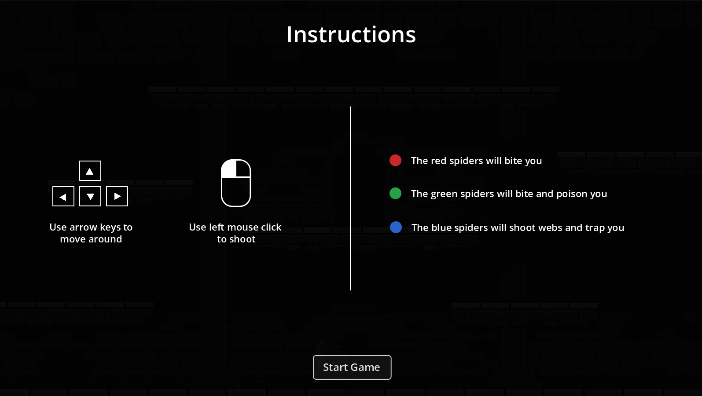
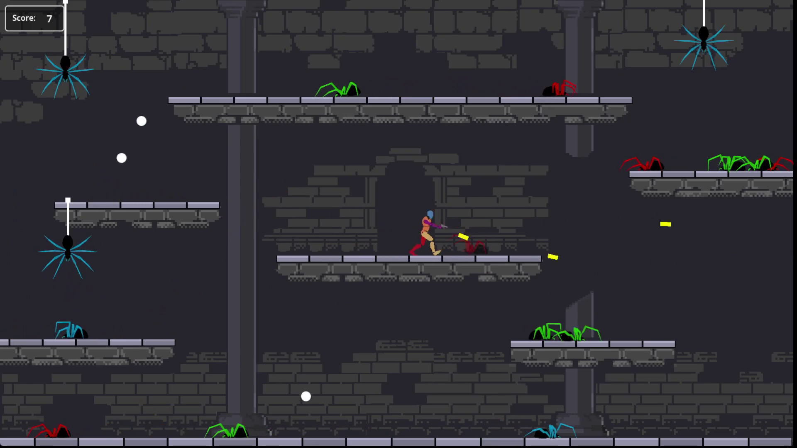
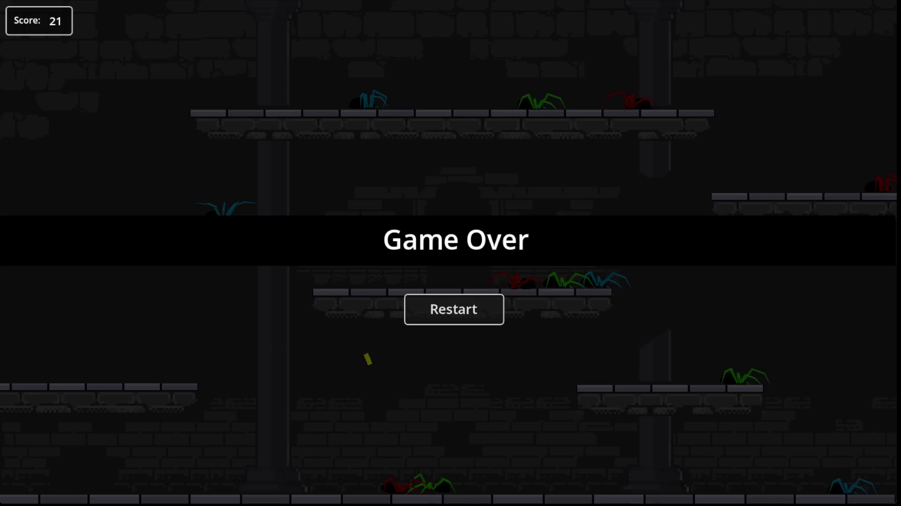

# 🎭 act-godot

This is the godot implementation of the **Act Pattern**.  
For a complete explaination & implementation in other game engines visit the [main repository][MainRepo].

> ## 🚧 Work in Progress 🚧
> This repo is still under construction i.e. test cases are yet to be added.  
> However, the core codebase & demo game have been completed so feel free to use at your own discretion.

Demo Showcase

  
  
  
<video controls src="raw_assets/showcase/showcase_vid.mp4" title="Title"></video>

## 🛠️ Installation
If you want to use the act pattern in your project install the desired version from the [releases page][Releases] & drop the 2 files anywhere in your project.  

> **Note**:  
> If you just want to view the code, Look into these 2 files:  
> 1. [`act.gd`](demo/act_pattern/act.gd)  
> 1. [`theater.gd`](demo/act_pattern/theater.gd)
>
> _Feel free to leave a ⭐ if you use this in your project!_  

## 🧭 Usage  
Look into the README of the [main repo][MainRepo] for the principle.  
Look into the [documentation](/DOCS.md) for an exhaustive explaination.

## 🤝 Contribution
You can contribute in the following ways:  
1. Report bugs or suggest features by opening a [new issue][Issue].
2. Write or improve test cases.
3. Sponsor this project.

## ❤️ Sponsor
If this project has been useful for you consider [supporting][Sponsor] its development.  
Any support motivates to keep the project well maintained, documented & growing.

## 🏆 Credits
1. 3D meshes & animations from [Mesh2Motion][Mesh2Motion].  
1. Sprite sheets created using [Sprite Sheet Maker][ssm].  
1. Castle background assets by [Raou][castle-asset].  

## 🔑 License
MIT © [Manas Ravindra Makde](https://manasmakde.github.io/)

[MainRepo]: https://github.com/ManasMakde/act
[Mesh2Motion]: https://mesh2motion.org/
[ssm]: https://extensions.blender.org/add-ons/sprite-sheet-maker/
[castle-asset]: https://raou.itch.io/dark-dun
[Releases]: https://github.com/ManasMakde/act-godot/releases
[Issue]: https://github.com/ManasMakde/act-godot/issues/new
[Sponsor]: https://github.com/sponsors/ManasMakde
